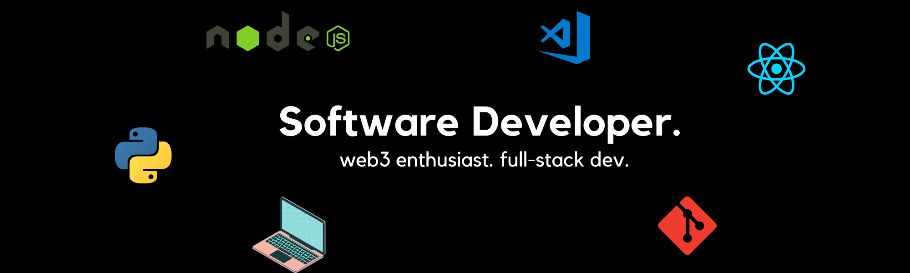

## 🛠️ Technologies & Tools

- **Programming/Scripting Languages worked with:** Python, C++, JavaScript
- **Frontend Development:** React.js, Next.js, Angular.js
- **Backend Development:** Node.js,
- **Mobile Development:**  
- **Databases:** SQL
- **DevOps Tools:** 
- **Version Control:** Git / GitHub 
- **Backend Operations:** 
  
## 👨🏻‍💻 Current Learning Goals

- Master web-dev + devops and web3 
- Solve more DSA 

## 🔌Connect with me 

## 🎯Github Stats 
 

&nbsp;
  
  

